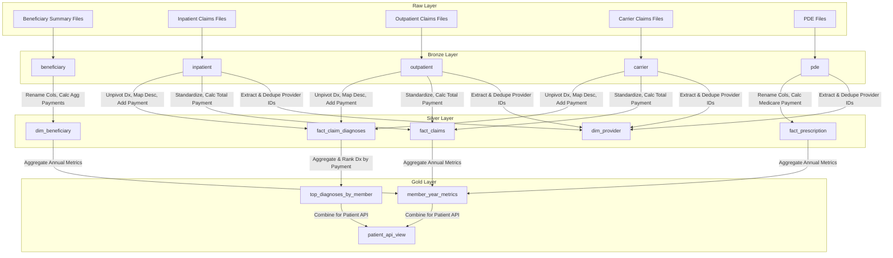

# Data Lineage Diagram

```mermaid
graph TD
    subgraph Raw Layer
        direction LR
        RawBene[Beneficiary Summary Files]
        RawInp[Inpatient Claims Files]
        RawOut[Outpatient Claims Files]
        RawCar[Carrier Claims Files]
        RawPDE[PDE Files]
    end

    subgraph Bronze Layer
        direction LR
        B_Inpatient[inpatient]
        B_Outpatient[outpatient]
        B_Beneficiary[beneficiary]
        B_Carrier[carrier]
        B_PDE[pde]
    end

    subgraph Silver Layer
        direction LR
        S_DimBeneficiary[dim_beneficiary]
        S_DimProvider[dim_provider]
        S_FactClaims[fact_claims]
        S_FactClaimDiagnoses[fact_claim_diagnoses]
        S_FactPrescription[fact_prescription]
    end

    subgraph Gold Layer
        direction LR
        G_MemberYearMetrics[member_year_metrics]
        G_TopDiagnosesByMember[top_diagnoses_by_member]
        G_PatientApiView[patient_api_view]
    end

    %% Raw to Bronze Layer Ingestion
    RawBene --> B_Beneficiary
    RawInp  --> B_Inpatient
    RawOut  --> B_Outpatient
    RawCar  --> B_Carrier
    RawPDE  --> B_PDE

    %% Bronze to Silver Layer Transformations
    B_Beneficiary -- "Rename Cols, Calc Agg Payments" --> S_DimBeneficiary

    B_Inpatient -- "Extract & Dedupe Provider IDs" --> S_DimProvider
    B_Outpatient -- "Extract & Dedupe Provider IDs" --> S_DimProvider
    B_Carrier -- "Extract & Dedupe Provider IDs" --> S_DimProvider
    B_PDE -- "Extract & Dedupe Provider IDs" --> S_DimProvider

    B_Inpatient -- "Standardize, Calc Total Payment" --> S_FactClaims
    B_Outpatient -- "Standardize, Calc Total Payment" --> S_FactClaims
    B_Carrier -- "Standardize, Calc Total Payment" --> S_FactClaims

    B_Inpatient -- "Unpivot Dx, Map Desc, Add Payment" --> S_FactClaimDiagnoses
    B_Outpatient -- "Unpivot Dx, Map Desc, Add Payment" --> S_FactClaimDiagnoses
    B_Carrier -- "Unpivot Dx, Map Desc, Add Payment" --> S_FactClaimDiagnoses

    B_PDE -- "Rename Cols, Calc Medicare Payment" --> S_FactPrescription

    %% Silver to Gold Layer Transformations
    S_DimBeneficiary -- "Aggregate Annual Metrics" --> G_MemberYearMetrics
    S_FactClaims -- "Aggregate Annual Metrics" --> G_MemberYearMetrics
    S_FactPrescription -- "Aggregate Annual Metrics" --> G_MemberYearMetrics

    S_FactClaimDiagnoses -- "Aggregate & Rank Dx by Payment" --> G_TopDiagnosesByMember

    G_MemberYearMetrics -- "Combine for Patient API" --> G_PatientApiView
    G_TopDiagnosesByMember -- "Combine for Patient API" --> G_PatientApiView
```
